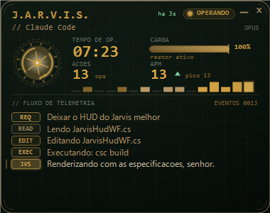
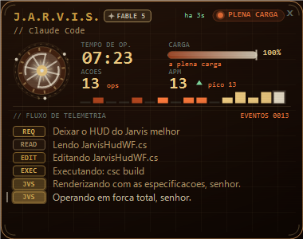
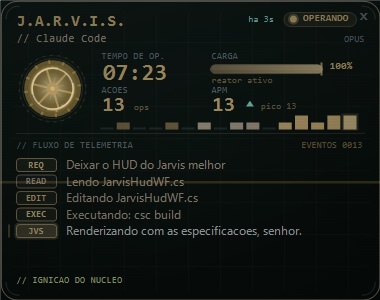
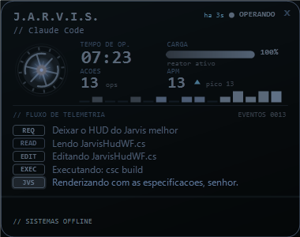
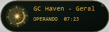

# J.A.R.V.I.S. for Claude Code

> A butler-voiced assistant layer for [Claude Code](https://claude.com/claude-code): it **speaks** to you, mirrors every event as a **native notification**, and runs a live **reactor-core HUD** on your desktop — one window per session, with cinematic ignition when it opens and a rather dramatic power-down when it's done.

<p align="center">
  
  &nbsp;
  
</p>
<p align="center">
  
  &nbsp;
  
</p>
<p align="center">
  
  &nbsp;
  
  <br /><em>Minimized: the whole panel folds into a live reactor capsule — click to expand.</em>
</p>

It hooks into Claude Code's event system (no polling, no cost) and reacts with pre-recorded lines: *"Positivo, senhor. Iniciando o trabalho."* when you send a prompt, *"Tarefa concluída, senhor."* when it finishes, energetic lines when you tell it to floor it, a gentle nudge at 3 a.m., and so on — **363 lines across 43 categories**, chosen by intent.

> The voice is a **Brazilian-Portuguese butler** (think Iron Man's JARVIS, but he calls you *"senhor"*). Fully pre-recorded, so playback is instant and free.

---

## What it does

- **Speaks** — picks a line by what you're doing (prompt / question / done / error / deploy / git / test / research / late-night / greetings…), never repeating the same line twice in a row.
- **Native notifications** — every line is mirrored to the OS notification center (Windows toast / macOS Notification Center) with the same text.
- **Robotic blip** — a short synth lead-in before each line.
- **Live desktop HUD** — a frameless, always-on-top mini-panel per session, finished like a real Stark-tech instrument: an animated arc-reactor core emanating light (counter-rotating rings, a dashed outer ring and orbiting energy motes), a status **capsule** with a breathing LED, the session's **real model tag** (OPUS / SONNET / …), uptime, actions, APM + trend, a load bar with an analog-style **VU peak-hold marker**, activity sparkline, and a color-coded telemetry feed (fresh entries flash an amber accent). The whole panel sits under a subtle **holographic glass** — scanlines, vignette, blueprint grid and corner brackets.
- **A reactor that reacts** — the core is wired to your session's real activity: the busier Claude gets (load + actions/min), the **faster it spins**, the **hotter it glows**, and the more often an **electric discharge** arcs between its rings. Idle, it settles into a calm amber pulse.
- **Cinematic event FX** — the panel is alive with what's happening: every new telemetry line sends a **shockwave ripple** out from the core, finishing a task triggers a **golden burst**, and re-energizing (going back to work) washes a warm **flash** from the edges. These fire only on real events, so the cost is near-zero when idle.
- **Minimize to a mini-reactor** — a **–** button collapses the whole panel into a tiny always-on-top **reactor capsule** (live core + session name + status) that tucks into the corner; click it and it **expands back** with a cinematic implosion/bloom morph. A **double-chevron** button next to it **minimizes every window at once** — all panels fold into their capsules and stack neatly in the dock.
- **Cinematic ignition** — when the HUD opens, it **boots like a CRT coming to life**: a spark of light stretches into a line, the screen opens vertically, colors warm up from cold steel to amber, and the reactor core flares — with a `// IGNICAO DO NUCLEO` → `// SISTEMAS ONLINE` boot readout.
- **Cinematic power-down** — when a task ends the HUD **cools down** (amber → steel-blue, every element recoloring, with brief CRT **glitch slices** where the warm colors fight back), **collapses like an old CRT**, and blinks out.
- **FABLE 5 overdrive mode** — when a session runs Anthropic's most powerful model (Claude Fable 5), the whole HUD goes into **overheat**: heated background, border pulsing between gold and ember, white-hot reactor core with 16 rays and 3 orbiting satellites, molten metrics, a shimmering **"✦ FABLE 5"** badge and a *"PLENA CARGA"* status — plus **28 dedicated voice lines**, delivered fully in character: Jarvis treats Fable 5 as his own **hidden full-power protocol**, unlocked only for top-priority work (*"Protocolo Fable 5 autorizado, senhor. Desviando toda a energia do reator para o senhor."*). Switching models mid-session triggers a **cinematic transition** both ways: a shockwave sweeps the HUD and a **physical jolt shakes the panel** while every element heats up (or cools down, steel-blue, back to normal), with an in-character voice line to match. Detection is instant — the desktop app's session file is read directly, with status-line and transcript-sniffing fallbacks.
- **Status line** — an optional Claude Code status line with model, folder, branch, live cost and clock (it also powers the Fable 5 detection, and marks the model with a golden ✦ when Fable is running).
- **Silence Protocol** — tell him *"silêncio"* in the chat and he confirms once, then goes quiet (*"Protocolo Silêncio ativado, senhor."*); say *"pode falar"* and the voice returns. Accepts durations (*"silêncio por 30 minutos"*, *"até segunda ordem"*), works from the CLI too (`node jarvis.mjs mute 2h`), and supports **daily quiet hours** (`node jarvis.mjs quiet 22-07`). Critical reserve alerts still get through — a butler knows when to break protocol.
- **Self-diagnosis** — `node doctor.mjs` sweeps the whole install (hooks wired? clips missing? state corrupted? toast identity registered? new version out?) and prints a report with a fix hint per finding; `--fix` repairs the safe ones, `--json` feeds your own Claude Code.
- **A cockpit** — `node jarvis.mjs` shows the whole system at a glance (version, voice state, library, live sessions, pending update) and fronts every command: `doctor`, `mute`/`unmute`, `quiet`, `test <category>` (hear any line on demand), `lines`, `update`.

## Platform support

| Feature | Windows | macOS |
|---|:---:|:---:|
| Butler voice | yes | yes |
| Native notifications | yes (WinRT toast) | yes (osascript) |
| Robotic blip | yes | yes |
| Live desktop HUD + ignition / power-down cinematics | yes (native) | yes (Electron) |
| FABLE 5 overdrive (HUD + voice) | yes | yes |
| Status line | yes | yes |
| Silence Protocol + CLI cockpit + doctor | yes | yes |

The desktop HUD ships two ways for the best of both worlds: a lightweight **native WinForms/GDI+** app on Windows, and a **cross-platform Electron** build on macOS — same reactor core, telemetry feed and cinematic power-down. Everyone gets the same experience.

## Requirements

- [Claude Code](https://claude.com/claude-code) and **Node.js** (any recent version).
- **Windows:** .NET Framework (ships with Windows) for the prebuilt HUD `.exe`; PowerShell (built-in) for audio + toasts.
- **macOS:** `afplay` and `osascript` (built in). For the desktop HUD, run `npm install` once inside `hud-electron/` (pulls Electron).

No API keys. No servers. No paid dependencies.

## Install

1. **Get the files** — clone or download this repo into your Claude config folder:
   ```bash
   git clone https://github.com/dafire144/claude-code-jarvis.git ~/.claude/jarvis
   ```
   *(Any folder works; `~/.claude/jarvis` is just tidy. On Windows that's `C:\Users\<you>\.claude\jarvis`.)*

2. **Run the installer** from inside the folder — it wires the hooks into your `~/.claude/settings.json` (with a backup, preserving any hooks you already have), sets up the Windows toast identity, and installs the macOS HUD's Electron:
   ```bash
   node install.mjs
   ```
   *(Prefer doing it by hand? Copy the `"hooks"` block from [`settings.example.json`](settings.example.json) into your settings and replace `__JARVIS_DIR__` with this folder's absolute path — forward slashes even on Windows. On Windows, also run `powershell -ExecutionPolicy Bypass -File setup-toast.ps1` once.)*

3. **Restart Claude Code.** Send a prompt — he should greet you. Not hearing anything? `node doctor.mjs` will tell you why.

To turn it off, remove the `hooks` block (or the lines you don't want). Every hook is independent. Re-running `node install.mjs` is always safe — it replaces its own entries and never touches yours.

## How it works

Claude Code fires **hooks** on events (prompt submitted, tool used, response finished, session ended…). Each hook runs a tiny Node script:

- **`jarvis-notify.mjs`** classifies the event/prompt by intent, picks a matching line from **`lines.mjs`**, drops it on a queue, and wakes a player. The player (PowerShell daemon on Windows, `mac-player.mjs` on macOS) drains the queue one line at a time and fires the notification in sync with the audio.
- **`hud-native.mjs`** tracks a per-session activity feed and launches/updates the HUD window (opens once a task has been running ~30s; closes ~20s after the task ends, with the power-down animation).

All state is local and ephemeral; nothing leaves your machine.

## The cockpit (CLI)

Everything is driveable from inside the install folder:

```bash
node jarvis.mjs              # status panel: version, voice state, library, live sessions
node jarvis.mjs doctor       # full self-diagnosis with fix hints (--fix repairs the safe ones)
node jarvis.mjs mute 2h      # Silence Protocol (also: 30m, sempre); unmute brings the voice back
node jarvis.mjs quiet 22-07  # daily quiet hours (quiet off disables)
node jarvis.mjs test fanout  # hear a random line from any category
node jarvis.mjs lines        # browse all categories and lines
node jarvis.mjs update       # update in place
```

You can also just ask in chat: **"silêncio"** mutes him (he confirms once, then goes quiet), **"pode falar"** unmutes. He answers with an in-character confirmation either way.

## Customizing the voice

The 377 `.mp3` clips in [`clips/`](clips/) are pre-generated (ElevenLabs). This public build **does not include the generator or any API key**, so the lines are fixed. Want your own voice or language? Edit [`lines.mjs`](lines.mjs) and regenerate the clips with your own ElevenLabs key — the mapping is `clips/{category}-{index}.mp3`. (A generator script is intentionally left out here to keep the repo key-free.)

## Updating

Jarvis checks GitHub for a new version **once a day** (a detached, non-blocking probe of this repo's `VERSION` file). When there is one, he tells you himself — *"Senhor, um aprimoramento para os meus sistemas está disponível."* — with a matching native notification. Then update in place with one command from inside the install folder:

```bash
node update.mjs
```

It stops the HUD windows (Windows), does `git pull` if you cloned — or downloads and overlays the latest zip if you didn't — and preserves all your local state. You can also just ask your own Claude Code to run it.

## Bug reports (anonymous, opt-out)

The folder ships a [`CLAUDE.md`](CLAUDE.md) so your own Claude Code can help you tweak anything here. When a change is motivated by a **defect** (something broken or annoying), it will also send a short **anonymous report** to the maintainer via `report-bug.mjs` — just the complaint summary, the version and the OS; no paths, no usernames, no session content — and tell you it did. Fixes then ship back to everyone through the update channel above. To disable reports entirely, set the environment variable `JARVIS_NO_REPORT=1`.

## Roadmap

- **Linux HUD** — the Electron HUD should run on Linux too; needs testing.
- Optional English voice pack.

## Notes

- Written and tested on **Windows**. The macOS voice/notification path is written carefully but **not yet verified on a real Mac** — please open an issue if something misbehaves.
- "J.A.R.V.I.S." is a nod to the Iron Man films; this is a personal, non-commercial fan project and is not affiliated with or endorsed by Marvel/Disney.

## License

[MIT](LICENSE) © Davi Lopes — built with [Claude Code](https://claude.com/claude-code).
